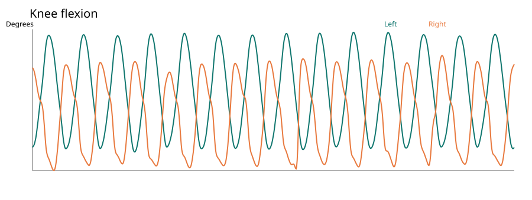

# Cycling Biomechanics Analyzer

Upload a cycling video to a job-based web app, or analyze an existing MotionBERT `X3D.npy` from the CLI. The application turns 3D pose trajectories into pedal-cycle, knee kinematics, bilateral timing, and pelvis movement metrics with a JSON report and SVG charts.

**Verified:** the custom analysis ran on the preserved Height1 trial (882 frames at 59.94 FPS), producing 13 detected cycles, `results.json`, and four charts. A fresh three-second video clip also completed the one-command AlphaPose → MotionBERT → report workflow. The FastAPI pose-upload route and Docker pose-analysis route each returned a completed 13-cycle report. The frontend production build passed. See [verification log](docs/VERIFICATION.md) for exact scope.

## Ownership and architecture

**Third-party ML:** AlphaPose performs pretrained Halpe-26 2D estimation. MotionBERT converts those detections to H36M-17 3D pose. I did not develop or train either model.

**My engineering contribution:** research signal processing, reusable analysis package, automated report/CLI, subprocess orchestration, job-based FastAPI API, dashboard, and tests. The original research code in `MotionBERT-main/examples/ActualTest/` is preserved. See [audit](docs/LEGACY_PROJECT_AUDIT.md) for exact provenance and limitations.


## Features

- 2nd-order, 6 Hz zero-phase Butterworth filtering, parameterized by FPS and cutoff.
- Right-knee trajectory peak detection, cycle segmentation, and interpolation to 100 normalized samples.
- Knee flexion from hip/knee/ankle vectors and angular velocity in degrees per second.
- Signed/absolute normalized knee-height symmetry index, normalized cross-correlation, and phase lag. Positive lag means the left signal occurs later than the right. The two legs naturally cycle out of phase; these descriptive measures are **not** clinical symmetry scores.
- Pelvis vertical velocity, acceleration, jerk, RMS jerk, and cycle consistency.
- Job-based upload API and responsive dashboard with stage polling.

Coordinate values are **MotionBERT model output units**. Physical scale has not been validated, so linear displacement/jerk is deliberately labeled in model units rather than meters or mm. The included knee angle uses a straight leg as 180°; flexion is `180° − included angle`.

## Quick start: existing 3D pose

Use Python 3.10+ with NumPy and SciPy:

```bash
python -m pip install -e '.[test]'
python -m cycling_analysis.cli analyze-pose sample/height1_X3D.npy --fps 59.94 --output sample/height1_analysis
python -m pytest tests/test_analysis.py
```

The result directory contains `results.json`, `X3Dfiltered.npy`, and four SVG charts. A fully independent pose analysis can run without AlphaPose, MotionBERT, PyTorch, or model weights.

## Full video CLI

The supplied MotionBERT code is in `MotionBERT-main/`. **AlphaPose source is deliberately excluded from Git** because its license restricts redistribution. Clone it locally into `AlphaPose-master/` from the [official repository](https://github.com/MVIG-SJTU/AlphaPose), then install each third-party repository's compatible inference dependencies and weights according to its own documentation. The defaults expect:

- `AlphaPose-master/pretrained_models/halpe26_fast_res50_256x192.pth`
- `MotionBERT-main/checkpoint/pose3d/FT_MB_lite_MB_ft_h36m_global_lite/best_epoch.bin`

These are local prerequisites, not files to commit. The included local AlphaPose checkout has a small inference-only switch that skips an unnecessary ImageNet initialization download before loading the full pose checkpoint; this checkout is excluded from the public Git set. If using a fresh upstream clone, its ordinary initialization may download ImageNet weights. Configure optional environment overrides in `.env.example` (the file is illustrative; export variables or use your shell's env loader). Run:

```bash
python -m cycling_analysis.cli analyze cycling.mp4 --output runtime/cli/my_ride
python -m cycling_analysis.cli analyze cycling.mp4 --skip-pose /path/to/X3D.npy --output runtime/cli/from_saved_pose
```

The first command uses AlphaPose's Halpe-26 model with `--sp --gpus -1`, then MotionBERT's existing `infer_wild.py`. It captures stdout/stderr in job-specific logs and raises an error if outputs are missing. `ffprobe` is required for video validation/FPS. The input should show one visible cyclist, because MotionBERT's wild inference is documented for one person.

## Web app

```bash
python -m pip install -e '.[api]'
uvicorn backend.main:app --reload
cd frontend && npm install && npm run dev
```

Visit the Vite URL. The app offers video upload and an existing 3D-pose upload mode, then polls job status. API examples:

```bash
curl http://localhost:8000/health
curl -F 'video=@cycling.mp4' http://localhost:8000/api/analyses
curl -F 'pose=@sample/height1_X3D.npy' -F 'fps=59.94' http://localhost:8000/api/poses
curl http://localhost:8000/api/analyses/ANALYSIS_ID
curl http://localhost:8000/api/analyses/ANALYSIS_ID/results
```

The MVP uses in-process background jobs and memory-backed status. Run one API worker. Jobs do not resume after restart; saved reports remain under `runtime/outputs/`. No queue or clinical interpretation is claimed.

## Existing macOS/CPU compatibility work

The upstream inference workflow was CUDA-oriented. The supplied project already contains adaptations for macOS/CPU development: MotionBERT conditionally moves model and input to CUDA, loads checkpoints with CPU-safe `map_location`, removes `module.` checkpoint prefixes, and uses `num_workers=0` with persistent workers disabled. AlphaPose's demo selects CPU when CUDA is unavailable, offers `--gpus -1`, and includes device-aware checkpoint loading and a NumPy compatibility shim. The new wrapper uses AlphaPose's single-process CPU mode and leaves those existing modifications intact. See [audit](docs/LEGACY_PROJECT_AUDIT.md) for source locations; absence of Git history limits attribution of each line.

## Docker

`docker compose build` and `docker compose up` provide a **CPU API/analysis container baseline**. Its `/api/poses` route analyzed the saved Height1 pose successfully in a built container. The image excludes pretrained weights and the legacy inference stacks, so video upload inference in this container requires separately installed/mounted inference dependencies. The native CLI is the supported full inference path. On this machine port 8000 was occupied; verification used `docker run -p 8001:8000 ...`.

## Testing and sample

Nine pytest tests cover five deterministic math cases, API health/validation, and a real pose upload that generates a report and serves a chart. The public sample input/report are under `sample/`; the original Height1–5 trial folders remain preserved locally and are excluded from Git to avoid publishing research videos and generated data.

## Screenshots

The browser dashboard was visually checked with a completed Height1 pose upload. The generated sample knee-flexion chart is shown below; add a browser screenshot after exporting one from your own run.



## Project background and limits

The source experiment studied five saddle-height configurations. This application reports biomechanical measurements; it does **not** determine an optimal saddle height or provide medical advice. No pose estimation accuracy, physical calibration, or test-retest validity has been measured. The verified fresh video clip was three seconds long and yielded one detected cycle, suitable for a workflow smoke test rather than substantive biomechanical interpretation. The preserved source video and output may not have identical frame counts due to legacy preprocessing.

## Licenses and acknowledgements

[AlphaPose](https://github.com/MVIG-SJTU/AlphaPose) and [MotionBERT](https://github.com/Walter0807/MotionBERT) are credited to their authors. MotionBERT's supplied `LICENSE` is Apache 2.0. AlphaPose's supplied `LICENSE` includes academic/noncommercial and redistribution restrictions, so its source is excluded from this Git project. No pretrained checkpoints are included.

Technologies: Python, NumPy, SciPy, FastAPI, React, Vite, SVG, ffmpeg/ffprobe, PyTorch in the third-party inference tools.
